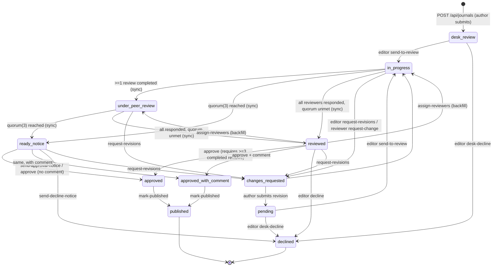
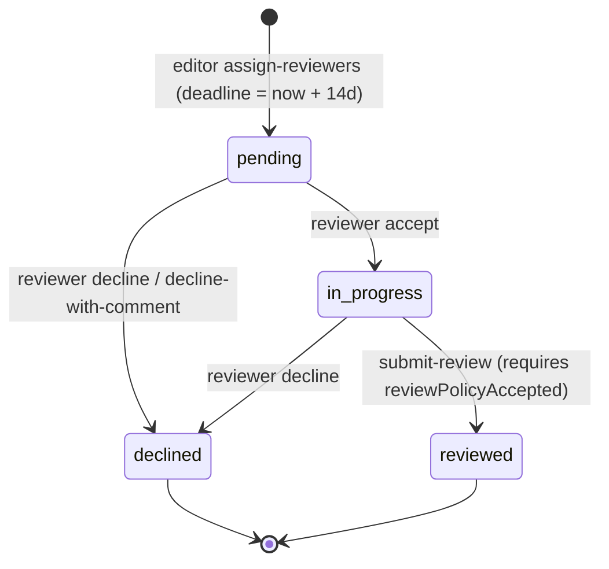
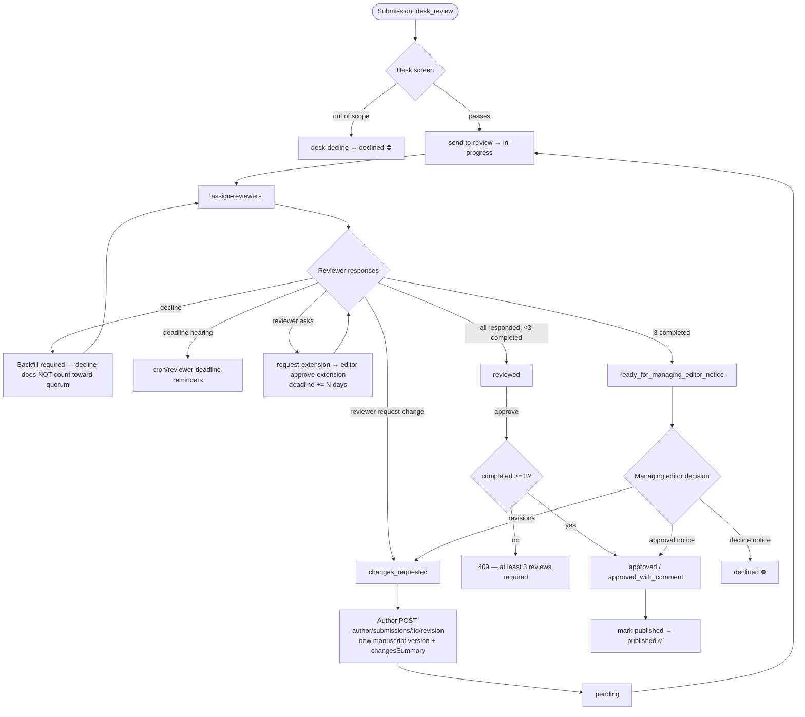
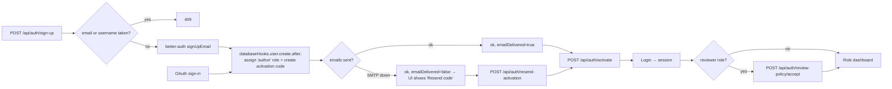
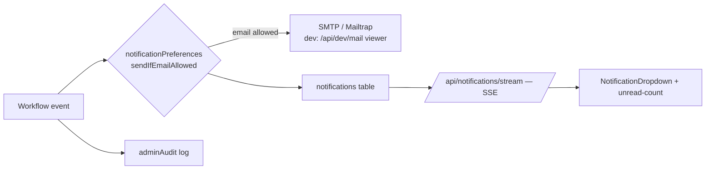

# japr — System Flow Diagrams

Derived from code (`shared/constants/*`, `server/utils/journalWorkflow.ts`, `server/api/**`), not from intent.
Every state/edge below is backed by an actual endpoint or transition table entry.

---

## 1. Manuscript state machine (`ALLOWED_MANUSCRIPT_TRANSITIONS`)



Notes that matter:

- `ready_notice` = `ready_for_managing_editor_notice`.
- The status engine (`syncJournalReviewStatus`) only recomputes while the manuscript is in
  `REVIEW_STAGE_STATUSES`; it never overwrites a terminal/editor decision, and it refuses any
  computed status the transition table doesn't sanction (logs an error instead).
- `REVIEW_QUORUM = 3` completed reviews. **Declines do not count** — they must be backfilled.
- `approved` vs `approved_with_comment` is decided purely by whether the editor supplied a comment.

---

## 2. Reviewer assignment state machine (`ALLOWED_REVIEWER_TRANSITIONS`)



Both `declined` and `reviewed` are terminal from the reviewer's side — re-invite/reopen is an
editor-initiated action, not modeled as a self-service transition.

---

## 3. End-to-end happy path (accept → publish)

```mermaid
sequenceDiagram
    autonumber
    participant A as Author
    participant API as Nitro API
    participant DB as Postgres
    participant E as Editor
    participant R as Reviewer x3
    participant N as Notify (in-app + email + SSE)

    A->>API: POST /api/files/upload-token → Blob upload
    A->>API: POST /api/journals (metadata + journalUrl)
    API->>DB: insert status=desk_review, isDraft=false
    API->>N: notify editors of new submission

    E->>API: POST /editor/journals/:uuid/send-to-review
    API->>DB: status=in-progress
    E->>API: POST .../assign-reviewers
    API->>DB: reviewers rows status=pending, reviewDeadline=+14d
    API->>N: invite each reviewer

    R->>API: POST /reviewer/journals/accept → status=in-progress
    R->>API: POST /reviewer/journals/submit-review
    API->>DB: reviewer status=reviewed (+rating, recommendation, confidentialComments)
    API->>API: syncJournalReviewStatus()
    Note over API: 1 done → under_peer_review<br/>3 done → ready_for_managing_editor_notice
    API->>N: notify author of status change; notify editors when quorum met

    E->>API: POST .../send-approval-notice (or /approve)
    API->>DB: status=approved | approved_with_comment, approvedAt
    API->>N: decision email to author + outcome to completed reviewers

    E->>API: POST .../mark-published
    API->>DB: status=published, copyEditStatus=published, publishedAt
    Note over DB: now matches PUBLIC_MANUSCRIPT_STATUSES → visible publicly
```

---

## 4. Alternate / failure scenarios



Guard failures you'll actually hit: `assertManuscriptStatus` → **400** with the current status in the
message; `assertReviewerStatus` → **409**. Submitting a review without `reviewPolicyAccepted` → **403**
(re-checked server-side, not just in the SPA middleware).

---

## 5. Auth / account lifecycle



Roles: `admin`, `editor_in_chief`, `managing_editor` (editor group) · `associate_editor`,
`external_reviewer`, `desk_editor` (reviewer group) · `author`, `copy_desk_editor`.

---

## 6. Visibility projection (who sees what)

```mermaid
flowchart TD
    REQ[Journal read] --> ROLE{resolve viewer role}
    ROLE -->|editor| E[Full row — reviewer identities, ratings, journalUrl]
    ROLE -->|owner author| O[sanitizeJournalForAuthor — reviewers anonymized 'Reviewer n',<br/>confidential comments hidden]
    ROLE -->|reviewer| RV[Co-reviewers anonymized, reviewersRatings=[],<br/>journalUrl→hasManuscriptFile]
    ROLE -->|public| P{isActive && !isDraft &&<br/>status in approved/approved_with_comment/published}
    P -->|no| X[404 / excluded]
    P -->|yes| PUB[Strips reviewers, ratings, createdBy/updatedBy/approvedBy/declinedBy,<br/>journalUrl, journalFormat — exposes hasManuscriptFile only]

    PUB --> DL[Download goes through authz'd /api/journals/:id/download<br/>which re-queries the row itself]
```

The storage key never leaves the server for non-editors. That's the single invariant holding up
reviewer confidentiality and manuscript ownership.

---

## 7. Notification fan-out



Email delivery failures are caught and logged — they never fail the workflow transition.
