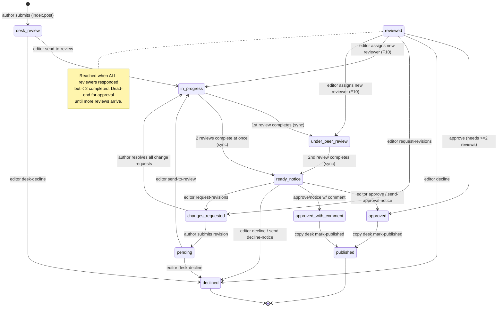

# Manuscript Submission & Review Lifecycle — Comprehensive Reference

> **Scope.** Everything that can happen to a manuscript from the moment an author submits it
> until it reaches a terminal state (published, declined), including every status, every
> transition, every guard, all the mistake/correction paths, and the concrete failure modes the
> code defends against.
>
> **Source of truth.** This document is derived by reading the code, not from memory. Every
> status value, transition, guard, error code, and side effect below was traced to a specific
> file. Key anchors:
> - Status enums + transition table: [manuscriptStatus.ts](../shared/constants/manuscriptStatus.ts), [reviewerStatus.ts](../shared/constants/reviewerStatus.ts)
> - DB schema: [journals.ts](../server/db/schema/journals.ts), [reviewers.ts](../server/db/schema/reviewers.ts), [manuscriptVersions.ts](../server/db/schema/manuscriptVersions.ts)
> - The sync engine + guards: [journalWorkflow.ts](../server/utils/journalWorkflow.ts)
> - Visibility projection: [journal-visibility.ts](../server/utils/journal-visibility.ts)
> - Author-facing notifications: [manuscriptStatusNotifications.ts](../server/utils/manuscriptStatusNotifications.ts)
>
> Where a statement is an **observation/inference** rather than an explicit rule in code, it is
> marked *(inference)*.

---

## 1. The three independent state machines

A single "manuscript" is really tracked by **three separate status columns**, on three tables.
Conflating them is the most common source of confusion.

| Machine | Table / column | Values | Who drives it |
|---|---|---|---|
| **Manuscript status** | `journals.approval_status` | 11 values (§3) | Editors directly, or the sync engine derived from reviewers |
| **Reviewer status** | `reviewers.status` | 4 values (§4) | Each reviewer (self-service) + editor re-assignment |
| **Version status** | `manuscript_versions.status` | 5 values (§5) | Write paths (currently only ever `'submitted'`) |

The manuscript machine is the spine. The reviewer machine feeds *into* it through
`syncJournalReviewStatus`. The version machine is a parallel audit trail and does **not** gate
anything.

---

## 2. Actors & the permission gate

Every mutation is gated by `requirePermission(event, resource, action)` /
`requireSession` / role checks before any status logic runs. Failing the gate throws **403**
(`"You do not have permission to perform this action."` or a route-specific message) — this
happens *before* the status guard, so an unauthorized caller never learns the manuscript's state.

| Actor | Relevant capability |
|---|---|
| **Author (owner)** | Create submission; edit while `pending`; submit revisions; resolve change requests; view own feedback/versions |
| **Reviewer** (`admin`, `associate_editor`, `external_reviewer`, `desk_editor`) | Accept/decline invitation; submit review; request field-level changes; request deadline extension |
| **Editor** (`admin`, `editor_in_chief`, `managing_editor`) | Desk triage; assign reviewers; approve/decline; request revisions; send managing-editor notices; approve extensions |
| **Copy desk** (`copy_desk_editor` + the editor roles) | Mark approved manuscript as published |
| **Admin** | All of the above + soft-delete |

> **Author-cannot-review guard.** `assign-reviewers` explicitly rejects assigning
> `journal.userId` as a reviewer of their own manuscript → **400** `"A manuscript's own author
> cannot be assigned as its reviewer."`

---

## 3. Manuscript statuses (`approval_status`)

Enum defined in [journals.ts:24](../server/db/schema/journals.ts#L24) and
[manuscriptStatus.ts:1](../shared/constants/manuscriptStatus.ts#L1). Label + badge color live in
the same constants file.

| Status | Label | Meaning | Group |
|---|---|---|---|
| `desk_review` | Desk Review | **Initial state** of a new submission; awaiting editor triage | pre-review |
| `pending` | Pending | Legacy initial state / where a revised manuscript lands after resubmission | pre-review |
| `in-progress` | In Progress | Sent to review; reviewers invited, none completed yet | review stage |
| `under_peer_review` | Under Peer Review | At least 1 review completed, but fewer than 2 | review stage |
| `ready_for_managing_editor_notice` | Ready For Managing Editor Notice | ≥ 2 reviews completed; ready for an editorial decision | review stage |
| `reviewed` | Reviewed | All invited reviewers responded (terminally), but < 2 *completed* reviews | review stage |
| `approved` | Approved | Editor accepted, no comment | terminal* |
| `approved_with_comment` | Approved With Comment | Editor accepted, with a comment | terminal* |
| `published` | Published | Copy desk published it | terminal |
| `declined` | Declined | Rejected (desk-decline, review decline, or notice) | terminal |
| `changes_requested` | Changes Requested | Sent back to the author for revision | recoverable |

\* `approved` / `approved_with_comment` are terminal for the *review* workflow but still have one
forward edge → `published`. See `TERMINAL_MANUSCRIPT_STATUSES` vs the transition table.

**Grouped sets** (used across queues, visibility, and the sync engine):

- `PUBLIC_MANUSCRIPT_STATUSES` = `approved`, `approved_with_comment`, `published` — the only
  statuses an anonymous viewer can see (`isPubliclyVisibleJournal` also requires `isActive &&
  !isDraft`).
- `TERMINAL_MANUSCRIPT_STATUSES` = `approved`, `approved_with_comment`, `published`, `declined`.
- `REVIEW_STAGE_STATUSES` = `in-progress`, `under_peer_review`, `ready_for_managing_editor_notice`,
  `reviewed` — **the only statuses the sync engine will recompute** (§7).

---

## 4. Reviewer statuses (`reviewers.status`)

Enum in [reviewers.ts:9](../server/db/schema/reviewers.ts#L9), transitions in
[reviewerStatus.ts:19](../shared/constants/reviewerStatus.ts#L19).

| Status | Meaning |
|---|---|
| `pending` | Invited, not yet responded |
| `in-progress` | Accepted the invitation, review not yet submitted |
| `declined` | Opted out (terminal from the reviewer's own side) |
| `reviewed` | Submitted a review (terminal from the reviewer's own side) |

**Self-service transitions** (`ALLOWED_REVIEWER_TRANSITIONS`):

```
pending      → in-progress | declined
in-progress  → reviewed    | declined
declined     → (terminal)
reviewed     → (terminal)
```

`declined` and `reviewed` are terminal for the reviewer. A re-invite or a reopen-after-review is
an **editor-initiated** action, deliberately *not* modeled as a self-service transition.

Two counting rules the manuscript machine depends on:
- **"Completed review"** = status `reviewed` **only**. A `declined` row never counts toward
  completion, even though `reviewSubmittedAt` may be set on a decline-with-comment.
- **"Terminal response"** = status `reviewed` **or** `declined` (the reviewer is done either way).

---

## 5. Version statuses (`manuscript_versions.status`)

Enum in [manuscriptVersions.ts:5](../server/db/schema/manuscriptVersions.ts#L5): `draft`,
`submitted`, `under_review`, `approved`, `rejected`.

> **Observation.** Every current write path (initial submission, author revision, version
> revert) inserts rows with `status: 'submitted'`. The other four enum members are not written by
> any code path traced here — treat them as reserved/forward-looking, not live signals. *(inference)*

Version numbering ([versionNumbering.ts](../server/utils/versionNumbering.ts)): major is hard-coded `1`; the next version is
`1.{highestMinor + 1}`, derived from the highest existing minor (not a count), so deleting/gaps
never cause a collision. The initial submission is `1.0`.

---

## 6. The happy path (end to end)



Narrative:

1. **Submit** → `desk_review`. A `manuscript_versions` row `1.0` is created in the *same
   transaction*; editors are notified; the author gets a "submission received" email.
2. **Desk triage** → editor either `send-to-review` (`→ in-progress`) or `desk-decline`
   (`→ declined`).
3. **Assign reviewers** → invitations sent (14-day default deadline). Assignment re-runs the
   sync engine.
4. **Reviewers respond** → each accept/decline/submit re-runs `syncJournalReviewStatus`, which
   walks the manuscript through `in-progress → under_peer_review → ready_for_managing_editor_notice`
   (or into `reviewed`, §9).
5. **Editorial decision** at `ready_for_managing_editor_notice` (or `reviewed`) → `approved` /
   `approved_with_comment` / `declined` / `changes_requested`.
6. **Publish** → editor hands off (`approve-for-publication` sets an internal flag), then copy
   desk `mark-published` → `published`.

---

## 7. The transition table & the sync engine

### 7.1 Authoritative transition table

`ALLOWED_MANUSCRIPT_TRANSITIONS` ([manuscriptStatus.ts:71](../shared/constants/manuscriptStatus.ts#L71))
is the single contract. `canTransitionManuscriptStatus(from, to)` is the check.

```
desk_review                       → in-progress, declined
pending                           → in-progress, declined
in-progress                       → under_peer_review, ready_for_managing_editor_notice,
                                    reviewed, changes_requested
under_peer_review                 → ready_for_managing_editor_notice, reviewed, changes_requested
ready_for_managing_editor_notice  → approved, approved_with_comment, declined, changes_requested
reviewed                          → approved, approved_with_comment, declined, changes_requested,
                                    in-progress, under_peer_review        ← reverse edges (F10/F11)
approved                          → published
approved_with_comment             → published
published                         → (none)
declined                          → (none)
changes_requested                 → pending, in-progress
```

### 7.2 Two enforcement layers (they are not the same!)

1. **Editor decision endpoints** enforce a **precondition allow-list** via
   `assertManuscriptStatus(current, allowed[], action)`. They do **not** call
   `canTransitionManuscriptStatus`. Their allow-lists are hand-maintained to be consistent with
   the table. Violation → **400** `"Manuscript must be <allowed joined by ' or '> before
   <action>. Current status: <current>."`
2. **The sync engine** (`syncJournalReviewStatus`) recomputes status from reviewers and *does*
   consult the transition table. If it computes a status the table doesn't sanction, it
   **refuses to write** and logs a `console.error` — the disagreement is surfaced as a bug, not
   silently performed (comment F11).

### 7.3 `syncJournalReviewStatus` — the derived-status engine

Located at [journalWorkflow.ts:47](../server/utils/journalWorkflow.ts#L47). Called by
reviewer accept? no — by **reviewer decline, review submit, assign-reviewers**. Steps:

1. Load the journal. **If its status is *not* in `REVIEW_STAGE_STATUSES`, return unchanged.**
   This is the guard that stops a late reviewer action from overwriting a terminal/editor
   decision (§9.5).
2. Load all reviewers and compute `getReviewWorkflowStatus`:
   ```
   completedReviews = count(status == 'reviewed')
   allResponded     = reviewers.length > 0 && every reviewer is terminal (reviewed|declined)

   completedReviews >= 2                     → ready_for_managing_editor_notice
   else allResponded                         → reviewed
   else completedReviews > 0                 → under_peer_review
   else                                      → in-progress
   ```
   (`MIN_PEER_REVIEWS_FOR_NOTICE = 2`.)
3. If computed == current, **no write, no notification** (avoids re-notifying the author on a
   no-op).
4. If the computed transition is **not** in the table → log error, leave unchanged.
5. Otherwise write the new status and fire **exactly one** author-facing
   `manuscript-status-changed` notification + email via `notifyAuthorOfManuscriptStatus`.

---

## 8. Endpoint catalogue (guards, effects, side effects)

Every route below is grouped by phase. Error codes and messages are verbatim.

### 8.1 Submission (author)

**`POST /api/journals` — create submission** ([index.post.ts](../server/api/journals/index.post.ts))
- **Permission:** `journal:create` (owner). Then a chain of server-side gates that mirror the SPA
  onboarding gate so the API can't be bypassed:
  - No research interests selected → **403** `"Select your research interests before submitting a manuscript."`
  - Review policy not yet accepted **and** `body.accept` false → **403** `"You must accept the review policy before submitting."`
  - If review policy not accepted but `body.accept` true → the policy is recorded (`reviewPolicyAccepted = true`).
  - A `journalUrl` the caller never obtained an upload token for → rejected by `verifyPendingUpload` *before* any row is created.
- **Validation** (`journalCreateSchema`): `title` 5–255, `author` 3–255, `description` 20–4000,
  `abstract` 50–12000, `country` 2–120, `journalLanguage` ∈ {American English, British English,
  French}, optional category UUIDs / meta fields / `journalUrl` / `license`, `agree`/`accept`
  booleans (default true).
- **Effect (one transaction):** insert journal with `approvalStatus = desk_review`,
  `isDraft = false`; attach the uploaded file; insert `manuscript_versions` `1.0`
  (`status: 'submitted'`). Crash mid-sequence leaves nothing partial (comment B7).
- **Side effects:** "submission received" email to author; in-app `new-submission` notification +
  email to every editor/admin/managing-editor.
- **Note:** `isDraft` is hard-coded `false` here; the create path never produces a draft. *(inference: draft manuscripts are not currently reachable via this route.)*

### 8.2 Desk triage (editor)

**`POST …/[uuid]/send-to-review`** ([send-to-review.post.ts](../server/api/editor/journals/[uuid]/send-to-review.post.ts))
- Permission `journal:approve`. Guard: `[desk_review, pending]`. Sets `→ in-progress`.
  Author notified.

**`POST …/[uuid]/desk-decline`** ([desk-decline.post.ts](../server/api/editor/journals/[uuid]/desk-decline.post.ts))
- Permission `journal:reject`. Guard: `[desk_review, pending]`. Body `reason` 5–2000 **required**.
  Sets `→ declined`, `editorDecisionComment = reason`, `editorDecisionDate`. Decision email +
  `journal-declined` notification. `notifyReviewersOfFinalDecision` runs but is a practical no-op
  (no reviewers assigned at desk stage).

### 8.3 Reviewer assignment (editor)

**`POST …/[uuid]/assign-reviewers`** ([assign-reviewers.post.ts](../server/api/editor/journals/[uuid]/assign-reviewers.post.ts))
- Permission `reviewer:assign`. Guard: `[in-progress, under_peer_review, reviewed]` — note
  `reviewed` is allowed so an editor can recruit a replacement when everyone declined (F10).
- Rejects assigning the author (400, §2).
- **Effect (one transaction):** upsert each reviewer row (`onConflictDoUpdate` on the
  `(journalId, userId)` unique index — an already-assigned reviewer keeps their real
  token/deadline/status, only `updatedAt` touched); rebuild the denormalized `journals.reviewers`
  list from **all** rows (not just this request's, fixing B8); then `syncJournalReviewStatus`.
- Each new reviewer gets `status = pending`, a fresh `token` (UUID), `assignedAt`, and a
  14-day `reviewDeadline`.
- **Side effects:** `review-assigned` notification + invitation email with one-click
  accept/decline URLs.

### 8.4 Reviewer response

| Route | Auth | Precondition | Effect | Manuscript effect |
|---|---|---|---|---|
| **`GET …/accept`** ([accept.get.ts](../server/api/reviewer/journals/accept.get.ts)) | token + `getCurrentUserContext` | **none** (non-mutating) | validates token/session, redirects to SPA confirm page | none |
| **`POST …/accept`** ([accept.post.ts](../server/api/reviewer/journals/accept.post.ts)) | `requireSession`, needs `reviewPolicyAccepted` (else 403) | `[pending]`; if already `in-progress` → idempotent `{ok:true}` before the guard | `isAccepted = true`, `status → in-progress` | **none** (accepting doesn't change counts) |
| **`GET …/decline`** ([decline.get.ts](../server/api/reviewer/journals/decline.get.ts)) | token | **none** (non-mutating) | redirect to confirm page | none |
| **`POST …/decline`** ([decline.post.ts](../server/api/reviewer/journals/decline.post.ts)) | `requireSession` | already `declined` → idempotent; else `[pending, in-progress]` | `status → declined` | **`syncJournalReviewStatus`** |
| **`POST …/decline-with-comment`** ([decline-with-comment.post.ts](../server/api/reviewer/journals/decline-with-comment.post.ts)) | `requireReviewer` (role) | `[pending, in-progress, declined]` (re-decline allowed to update comment; `reviewed` excluded) | `status → declined`, `comment`, `reviewSubmittedAt` | **`syncJournalReviewStatus`** (returns new status) |
| **`POST …/submit-review`** ([submit-review.post.ts](../server/api/reviewer/journals/submit-review.post.ts)) | `requireReviewer`, needs `reviewPolicyAccepted` | `[in-progress]` only | writes review/comment/rating/recommendation, `status → reviewed`, `reviewSubmittedAt` | **`syncJournalReviewStatus`**; notifies editors if all complete or notice-ready |
| **`POST …/request-change`** ([request-change.post.ts](../server/api/reviewer/journals/request-change.post.ts)) | `requireReviewer` + must be assigned to this journal | manuscript guard `[in-progress, under_peer_review, ready_for_managing_editor_notice, reviewed]` | appends field-level entries to `journals.changeRequests` | **direct `→ changes_requested`** (does NOT call sync) |
| **`POST …/[uuid]/request-extension`** ([request-extension.post.ts](../server/api/reviewer/journals/[uuid]/request-extension.post.ts)) | `requireReviewer` + assigned | **none** | `deadlineExtensionRequested = true`, stores reason | none |

**The one-click email links (`GET`) are deliberately non-mutating** (comment F5): a state-changing
GET is prefetchable and CSRF-triggerable, so all writes happen in the `POST` handler the SPA
confirm page calls.

### 8.5 Editorial decision (editor)

| Route | Permission | Precondition | Result status | Extra guard |
|---|---|---|---|---|
| **`approve`** ([approve.post.ts](../server/api/editor/journals/[uuid]/approve.post.ts)) | `journal:approve` | `[reviewed, ready_for_managing_editor_notice]` | `approved` / `approved_with_comment` (by comment presence); sets `approvedAt`, `editorDecisionDate` | **≥ 2 completed reviews** else **409** `"At least 2 reviews must be completed before approval."` |
| **`decline`** ([decline.post.ts](../server/api/editor/journals/[uuid]/decline.post.ts)) | `journal:reject` | `[reviewed, ready_for_managing_editor_notice]` | `declined`; `reason` required 5–2000 | — |
| **`request-revisions`** ([request-revisions.post.ts](../server/api/editor/journals/[uuid]/request-revisions.post.ts)) | `journal:request_revisions` | `[in-progress, under_peer_review, ready_for_managing_editor_notice, reviewed]` | `changes_requested`; `details` required 10–2000; **appends** to `changeRequests` (F9) | — |
| **`send-approval-notice`** ([send-approval-notice.post.ts](../server/api/editor/journals/[uuid]/send-approval-notice.post.ts)) | `journal:send_approval_notice` | `[ready_for_managing_editor_notice]` | `approved`/`approved_with_comment`; sets `approvedAt`, `managingEditorNoticeSentAt`; writes a `journalComments` row | no idempotency check beyond status |
| **`send-decline-notice`** ([send-decline-notice.post.ts](../server/api/editor/journals/[uuid]/send-decline-notice.post.ts)) | `journal:send_decline_notice` | `[ready_for_managing_editor_notice]` | `declined`; sets `managingEditorNoticeSentAt`, `declinedBy`; writes `journalComments` row; `reason` required | no idempotency check beyond status |
| **`approve-extension`** ([approve-extension.post.ts](../server/api/editor/journals/[uuid]/approve-extension.post.ts)) | `reviewer:assign` | **none** (operates on reviewer row) | extends `reviewDeadline` by `extensionDays` (default 7, 1–90); clears the request flag; preserves `originalDeadline` | reviewer must belong to journal |

`approve` and `decline` are the "direct" decision paths; `send-approval-notice` /
`send-decline-notice` are the managing-editor "notice" paths (restricted to
`ready_for_managing_editor_notice`, and they additionally leave a `journalComments` audit row +
stamp `managingEditorNoticeSentAt`). All four set `editorDecisionComment`/`editorDecisionDate` and
notify the author; approvals/declines also run `notifyReviewersOfFinalDecision` (reviewers who
*completed* a review hear the outcome; declined reviewers are skipped).

### 8.6 Publication (editor → copy desk)

**`POST …/[uuid]/approve-for-publication`** ([approve-for-publication.post.ts](../server/api/editor/journals/[uuid]/approve-for-publication.post.ts))
- Permission `journal:publish`. Guard `[approved, approved_with_comment]`.
- **Does NOT change `approvalStatus`.** It sets `copyEditStatus = 'ready_for_publication'` (an
  internal editor→copy-desk hand-off flag) and optionally updates `editorDecisionComment`
  (max 5000). **No author notification / email** (deliberate — avoids duplicate approval notices).

**`POST …/[uuid]/mark-published`** ([mark-published.post.ts](../server/api/editor/journals/[uuid]/mark-published.post.ts))
- Role: editor **or** copy desk. Guard `[approved, approved_with_comment]`.
- **Hand-off guard (F12):** if `copyEditStatus !== 'ready_for_publication'` → **400**
  `"This manuscript must be approved for publication by an editor before copy desk can publish
  it."` — you cannot skip `approve-for-publication`.
- Sets `→ published`, `copyEditStatus = 'published'`, `publishedAt`. Author notified.

### 8.7 Author correction paths

**`POST /api/author/submissions/[id]/revision`** ([revision.post.ts](../server/api/author/submissions/[id]/revision.post.ts))
- `requireAuthor`; ownership enforced (else 404 `"Submission not found."`).
- **Guard `[changes_requested]` only.** Any other status → **400**
  `"Manuscript must be changes_requested before submitting a revision. Current status: <x>."`
- **Effect (transaction):** `→ pending`; inserts a new `manuscript_versions` row
  (`1.{minor+1}`, `parentVersionId` = last version, `status:'submitted'`);
  updates `journalUrl`/`journalFormat` if a new file was uploaded (validated via
  `verifyPendingUpload` first). `changesSummary` required (10–1000).
- Notifies the author + editors (`revision-uploaded`).

**`POST /api/author/submissions/[id]/author-update`** ([author-update.post.ts](../server/api/author/submissions/[id]/author-update.post.ts))
- `requireSession`; ownership check on `session.appUser.id` (else 403).
- **No status guard.** Iterates `changeRequests`, and for each entry with a `pending` status and
  a matching field in `body.updates`, marks it `resolved` (records `author_update`,
  `resolved_at`) and mirrors `title`/`abstract`/`description` onto the journal.
- **If there is ≥ 1 change request and *all* are now resolved → `approvalStatus = in-progress`.**
- Notifies the editors who raised the requests (`changes-resolved`). Does **not** create a version
  row.
- **Permissive matching (edge case):** any non-empty author value resolves a request; it does
  **not** verify the author actually addressed the suggested text.

**`PATCH /api/journals/[id]`** ([[id].patch.ts](../server/api/journals/[id].patch.ts))
- `requireSession`; owner **or** `journal:update`.
- **Owner-only guard:** a plain owner may edit **only while `pending`** — else **400**
  `"Only pending manuscripts can be edited by authors."` A user with `journal:update`
  (editor/admin) bypasses this at any status.
- Updates content/meta fields; **never changes `approvalStatus`**; no version row.

### 8.8 Versions & deletion

- **`GET …/versions`**, **`GET …/versions/[versionId]`**, **`POST …/versions/compare`** — read
  access = admin / editorial role / owner / assigned reviewer. Compare returns an HTML diff
  (diff-match-patch, HTML-escaped).
- **`POST …/versions/revert`** ([revert.post.ts](../server/api/journals/[id]/versions/revert.post.ts))
  — **write** access = admin / editorial role / owner **only** (reviewers excluded). No status
  guard. Revert is **additive**: it creates a *new forward* version copying the source
  (`changesSummary = "Reverted from version <n>"`, `parentVersionId` = source) and updates the
  journal's title/abstract/`description` (← source `content`). It never mutates or deletes
  existing rows and never changes `approvalStatus`.
- **`DELETE /api/journals/[id]`** ([[id].delete.ts](../server/api/journals/[id].delete.ts)) —
  **admin only**. **Soft delete** (`isActive = false`); **no status guard** — an admin can
  "delete" a manuscript in any status. `approvalStatus` and versions are untouched.

---

## 9. Edge cases & failure modes (the important part)

Each case below states the scenario, what the code does, and where it's enforced.

### 9.1 A single reviewer declines (0 completed reviews)
The only reviewer is terminal (`declined`), `completedReviews = 0`, `allResponded = true` →
engine computes `reviewed`. The transition `in-progress → reviewed` is **explicitly legalized**
in the table (comment F11) so the engine doesn't disagree with itself. The manuscript sits at
`reviewed` with **zero** usable reviews.

### 9.2 All reviewers decline
Same as 9.1 with more rows: everyone terminal, `completedReviews < 2` → `reviewed`. This is the
**"dead-end at reviewed"** state.

### 9.3 The `reviewed` dead-end and how to escape it
At `reviewed` with `< 2` completed reviews, `approve` throws **409**
(`"At least 2 reviews must be completed before approval."`). The editor's legal escapes from
`reviewed` are:
- **Assign more reviewers** → allowed from `reviewed` (§8.3); the new `pending` reviewer makes the
  engine recompute back to `in-progress`/`under_peer_review`. This *reverse* edge
  (`reviewed → in-progress`/`under_peer_review`) is legalized in the table for exactly this reason
  (comments F10/F11).
- **`request-revisions`** → `changes_requested` (send back to author).
- **`decline`** → `declined`.

### 9.4 Two reviews complete "at once"
If the second reviewer's submission pushes `completedReviews` from 0/1 straight to ≥2, the engine
jumps `in-progress → ready_for_managing_editor_notice` directly — that edge is in the table.

### 9.5 A late reviewer acts after the editor already decided
Suppose the editor already moved the manuscript to `approved`/`declined`/`changes_requested`, then
a straggler reviewer submits or declines. `syncJournalReviewStatus` sees the status is **not** in
`REVIEW_STAGE_STATUSES` and **returns immediately without writing** — the editor's decision is
never clobbered. (The reviewer's own row still updates; only the *manuscript* status is protected.)

### 9.6 Reviewer double-actions & idempotency
- **Double-accept** → `POST accept` returns `{ok:true}` (idempotent) when already `in-progress`.
- **Double-decline** → `POST decline` returns `{ok:true}` when already `declined`.
- **`decline-with-comment` is NOT idempotent** — re-declining rewrites the comment/`reviewSubmittedAt`
  and re-runs sync + editor notification. (Intentional: it lets a reviewer update their decline
  reason.)

### 9.7 Illegal reviewer transitions (all → 409)
`assertReviewerStatus` throws **409** `"Review must be <allowed> before <action>. Current status:
<x>."` for:
- **Accept after decline** (status `declined`, not `pending`).
- **Submit a review when not `in-progress`** (pending = never accepted; declined = opted out;
  reviewed = already submitted). *There is no self-service resubmission* — fixing a submitted
  review requires editor intervention (a deliberate integrity/auditability trade-off).
- **Decline after reviewed** (a completed review can't be retroactively withdrawn — it would
  corrupt the `approve` count).

### 9.8 Reviewer forcing `changes_requested`
`request-change` used to let any reviewer-role user push *any* manuscript (even
published/declined) into `changes_requested`. It now requires the caller to be **assigned to that
journal** and passes a manuscript-status guard `[in-progress, under_peer_review,
ready_for_managing_editor_notice, reviewed]`. The reviewer's field-level entries are **appended**
to `changeRequests`; a later editor `request-revisions` also appends rather than overwrites (F9),
so neither destroys the other's entries.

### 9.9 Author editing at the wrong time
- A plain owner can `PATCH` a journal **only while `pending`**; any other status → 400. Editors/
  admins bypass.
- A revision can be submitted **only from `changes_requested`**; otherwise 400. So an author can't
  "revise" an approved or in-review manuscript.
- `author-update` has **no** status guard — it can run at any status but only *does* something
  when there are `pending` change requests to resolve, and only flips to `in-progress` when all
  are resolved.

### 9.10 Publishing without the hand-off
Copy desk cannot publish an `approved` manuscript unless an editor first ran
`approve-for-publication` (which sets `copyEditStatus = 'ready_for_publication'`). Missing that
flag → 400 (F12). `approve-for-publication` itself changes **no** status — a common source of
"why is it still 'approved'?" confusion. The two-step design gives copy desk an observable action.

### 9.11 Two approval paths, two decline paths (which to use)
- **`approve`** — direct acceptance; allowed from `reviewed` **or** `ready_for_managing_editor_notice`;
  enforces the ≥2-review minimum.
- **`send-approval-notice`** — managing-editor notice; **only** from
  `ready_for_managing_editor_notice`; also stamps `managingEditorNoticeSentAt` and writes an audit
  comment. (It does **not** independently re-check the ≥2 minimum — reaching
  `ready_for_managing_editor_notice` already implies ≥2 completed reviews via the engine.)
- **`decline`** (from `reviewed`/`ready_notice`) vs **`send-decline-notice`** (only from
  `ready_notice`, also sets `declinedBy` + audit comment) vs **`desk-decline`** (from
  `desk_review`/`pending`).

### 9.12 Concurrency: duplicate reviewer assignment
Two concurrent `assign-reviewers` calls for the same journal+user previously raced into duplicate
rows. A **unique index** on `(journalId, userId)` ([reviewers.ts:58](../server/db/schema/reviewers.ts#L58))
turns the race into a DB-level `onConflictDoUpdate` (B8) instead of a silent duplicate. The
denormalized `journals.reviewers` list is rebuilt from **all** rows, so an earlier assignee is
never dropped.

### 9.13 Invitation tokens: no expiry, no consumption
Tokens are random UUIDs stored on the reviewer row. **No route expires or consumes a token**, and
there is **no expiry check** anywhere (the token schema only length-checks 1–255). Replay
protection is provided *entirely* by the reviewer `status` guards — e.g. a used accept link is
harmless because the second accept is idempotent, and a decline link on a `reviewed` row is a 409.
*(Observation: if token secrecy is later required, this is the gap to close.)*

### 9.14 Deadlines & extensions
Default review window = **14 days** from assignment ([reviewerDeadlines.ts](../server/utils/reviewerDeadlines.ts)). A reviewer's
`request-extension` only records a request flag + reason (no status/deadline change). An editor's
`approve-extension` applies it additively (`reviewDeadline += extensionDays`, default 7, range
1–90), clears the request flag, and preserves the pre-extension deadline in `originalDeadline`.
There is **no automatic escalation** when a deadline lapses in the paths traced here.

### 9.15 Notification de-duplication
The author hears about review progress through the **single** `manuscript-status-changed`
notification emitted by the sync engine, and only on a **real** transition. That's why
`submit-review` / `decline-with-comment` deliberately do **not** send their own per-review author
notification. `syncJournalReviewStatus` also short-circuits when computed == current, so no-op
recomputes stay silent.

### 9.16 Legacy `pending` rows
`desk_review` is the current initial state, but `pending` remains a valid pre-review status
(desk actions accept both) so pre-existing rows and revised manuscripts (which land in `pending`)
keep working. Databases created before the desk/publication migration must be migrated before code
referencing `desk_review`/`published` runs.

### 9.17 Terminal manuscripts are truly frozen
`published` and `declined` have **no** outgoing edges. `approved`/`approved_with_comment` have
exactly one (`→ published`). Once terminal:
- The sync engine won't touch them (§9.5).
- Editor decision endpoints' preconditions exclude them.
- The **only** reopen path is editorial: from `ready_notice`/`reviewed` you can still
  `request-revisions` before finalizing, but after `approved`/`declined`/`published` there is no
  in-code transition back into review. Recovery would require a manual/admin data change.

### 9.18 Visibility during the lifecycle
`projectJournalForViewer` ([journal-visibility.ts](../server/utils/journal-visibility.ts)) gates
what each role sees regardless of status:
- **public/anonymous** — only `approved`/`approved_with_comment`/`published` **and**
  `isActive && !isDraft`; reviewer identities, editorial metadata, and the raw storage key are
  stripped (only `hasManuscriptFile` boolean leaks).
- **owner** — sanitized author view (co-reviewer identities anonymized to "Reviewer 1/2…").
- **reviewer** — own view with co-reviewer identities anonymized and the editor-only ratings
  hidden.
- **editor** — full row.
Downloads always go through the authz'd `/api/journals/[id]/download` endpoint, never the raw key.

---

## 10. Mistake → correction cheat-sheet

| Who | Mistake | Recovery path |
|---|---|---|
| Author | Submitted with wrong metadata, still `pending` | `PATCH /api/journals/[id]` (allowed while `pending`) |
| Author | Submitted with wrong metadata, already in review | Cannot self-edit; wait for `changes_requested`, then submit a revision, or ask an editor |
| Author | Needs to fix content after `changes_requested` | `revision` (→ `pending`, new version) **or** `author-update` to resolve each change request (→ `in-progress` when all resolved) |
| Reviewer | Accepted by mistake | Decline (`in-progress → declined` allowed) |
| Reviewer | Declined by mistake | **Cannot self-undo** (declined is terminal); editor must re-assign |
| Reviewer | Submitted a wrong review | **Cannot self-resubmit** (reviewed is terminal → 409); editor intervention required |
| Reviewer | Needs more time | `request-extension`; editor approves via `approve-extension` |
| Editor | Sent to review too early | No direct "unsend"; use `request-revisions` (→ `changes_requested`) or `desk-decline` before sending, or decline |
| Editor | Approved but not ready to publish | `approve-for-publication` is the *only* thing that arms publishing; simply don't run `mark-published` yet |
| Editor | Stuck at `reviewed` with < 2 reviews | Assign more reviewers (reverse edge), request revisions, or decline (§9.3) |
| Copy desk | Tried to publish an un-handed-off manuscript | 400 (F12); an editor must run `approve-for-publication` first |
| Admin | Remove a manuscript | `DELETE` = soft delete (`isActive=false`); reversible by flipping the flag |

---

## 11. Appendix — status/HTTP-code quick reference

- **Manuscript status guard failure** → **400**, `"Manuscript must be … before …. Current status: …."`
- **Reviewer status guard failure** → **409**, `"Review must be … before …. Current status: …."`
- **< 2 completed reviews on approve** → **409**, `"At least 2 reviews must be completed before approval."`
- **Publish without hand-off** → **400**, `"This manuscript must be approved for publication by an editor before copy desk can publish it."`
- **Author self-edit outside `pending`** → **400**, `"Only pending manuscripts can be edited by authors."`
- **Permission gate** → **403**; **not found** → **404**; **missing id** → **400** `"Missing journal id."`

---

*Generated from the state of the code on branch `fix/design-system-unification`. If any endpoint's
guard list changes, update both this doc and the `ALLOWED_MANUSCRIPT_TRANSITIONS` table together —
they are meant to stay consistent (§7.2).*
